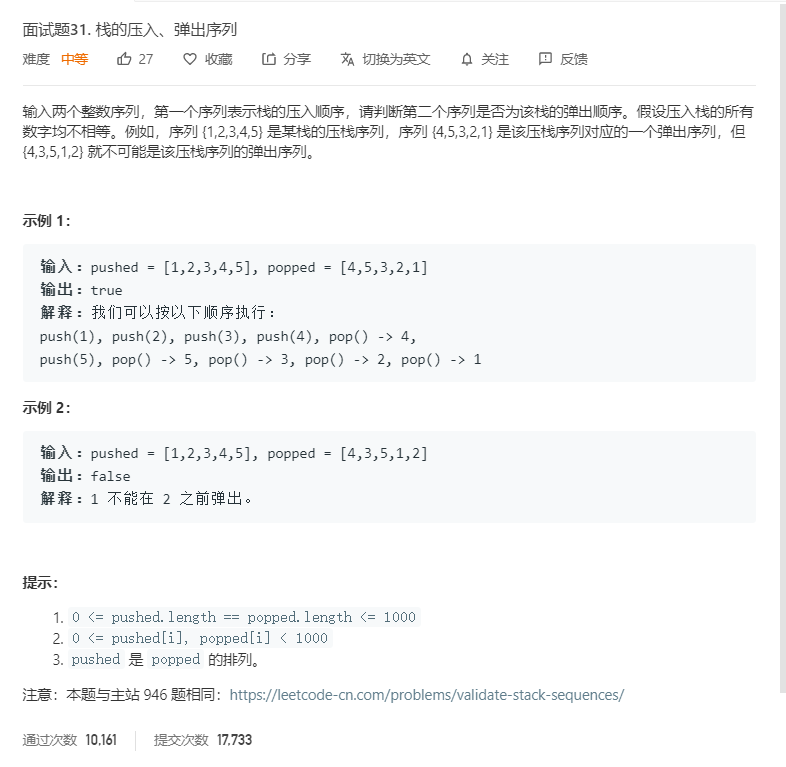

# 面试题31.栈的压入、弹出序列
  

```
/**
 * @param {number[]} pushed
 * @param {number[]} popped
 * @return {boolean}
 */
var validateStackSequences = function(pushed, popped) {
    let temp = [],position = 0;
    while(popped.length > 0){
        let now = popped.shift();
        console.log(now)
        while(pushed[position] != now && position < pushed.length){
            position++;
        }

        if(pushed[position] == now){
            pushed.splice(position,1);
            position--;
        }else{
            console.log(position,now);
            return false;
        }
    }

    return true;
};
```