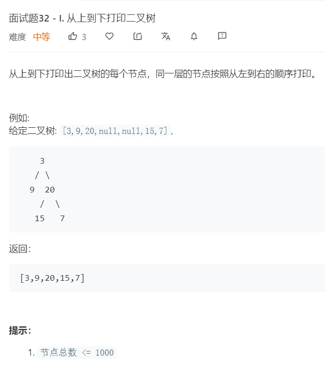

# 面试题32-1.从上到下打印二叉树
  

```
/**
 * Definition for a binary tree node.
 * function TreeNode(val) {
 *     this.val = val;
 *     this.left = this.right = null;
 * }
 */
/**
 * @param {TreeNode} root
 * @return {number[]}
 */
var levelOrder = function(root) {
    if(!root){
        return [];
    }
    let temp = [root],result = [];

    while(temp.length){
        let now = temp.shift();
        result.push(now.val);

        if(now.left){
            temp.push(now.left);
        }

        if(now.right){
            temp.push(now.right);
        }
    }

    return result;
};
```