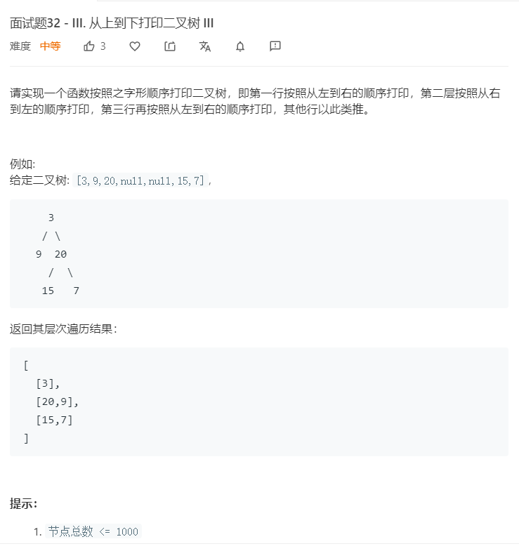

# 面试题32-3.从上到下打印二叉树III
  

```
/**
 * Definition for a binary tree node.
 * function TreeNode(val) {
 *     this.val = val;
 *     this.left = this.right = null;
 * }
 */
/**
 * @param {TreeNode} root
 * @return {number[][]}
 */
var levelOrder = function(root) {
    if(!root){
        return [];
    }
    let temp = [root],result = [];

    while(temp.length){
        let one = [],two = [];
        while(temp.length){
            let now = temp.shift();
            one.push(now.val);

            if(now.left){
                two.push(now.left);
            }

            if(now.right){
                two.push(now.right);
            }
        }
        result.push(one);
        temp = two;
    }

    for(let i=1;i<result.length;i++){
        if((i+1) % 2 == 0){
            result[i].reverse();
        }
    }

    return result;
};
```