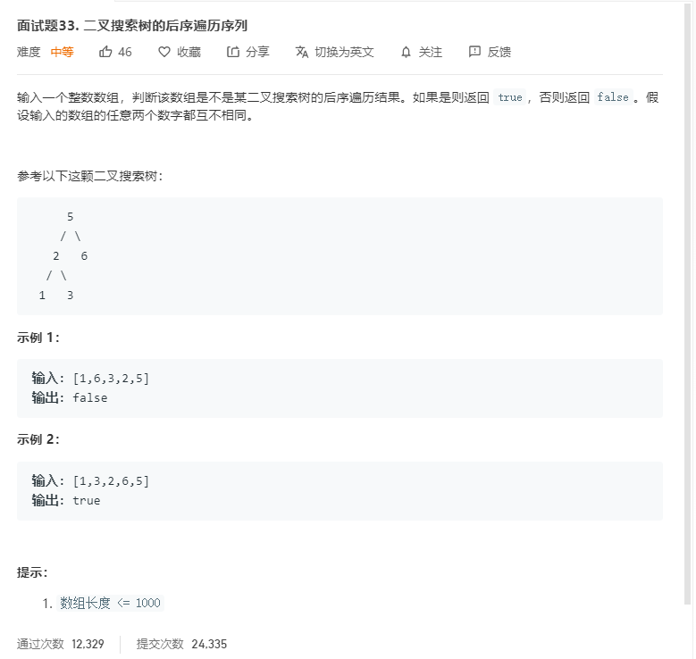

# 面试题33.二叉搜索树的后序遍历序列
  

```
/**
 * @param {number[]} postorder
 * @return {boolean}
 */
var verifyPostorder = function(postorder) {
    return mid(postorder,0,postorder.length-1);
};

const mid = (r,start,end) => {
    if(start >= end) {
        return true;
    }

    let tempstart = start;
    while(r[tempstart] < r[end]) {
        tempstart++;
    }

    let mate = tempstart;

    while(r[tempstart] > r[end]) {
        tempstart++;
    }

    return tempstart == end && mid(r,start,mate-1) && mid(r,mate,end-1);
}
```