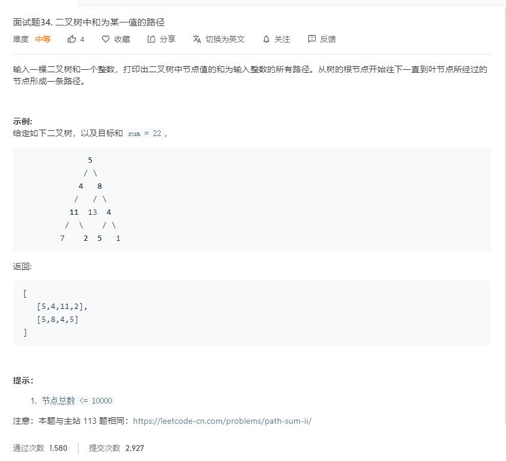

# 面试题34.二叉树中和为某一值的路径
  

```
/**
 * Definition for a binary tree node.
 * function TreeNode(val) {
 *     this.val = val;
 *     this.left = this.right = null;
 * }
 */
/**
 * @param {TreeNode} root
 * @param {number} sum
 * @return {number[][]}
 */
var pathSum = function(root, sum) {
    let result = [];
    let one = (root,list,temp) => {
        if(!root){
            return;
        }
        if(root){
            list.push(root.val);
            temp += root.val;
            if(temp == sum && !root.left && !root.right){
                result.push(list);
                return;
            }
            one(root.left,list.slice(),temp);
            one(root.right,list.slice(),temp);
        }
    }

    one(root,[],0);
    return result;
};
```