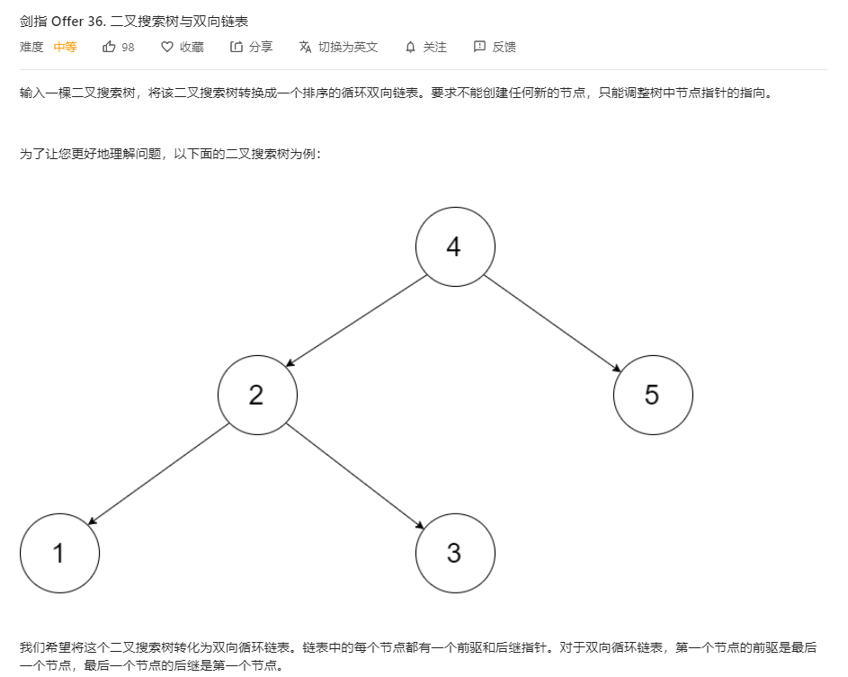
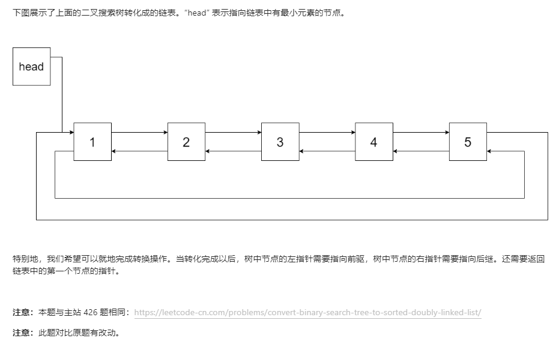

# 面试题36.二叉搜索树与双向链表
  

  

```
/**
 * // Definition for a Node.
 * function Node(val,left,right) {
 *    this.val = val;
 *    this.left = left;
 *    this.right = right;
 * };
 */
/**
 * @param {Node} root
 * @return {Node}
 */
var treeToDoublyList = function(root) {
    if (!root) {
        return null;
    }
    let res = [], head = null, pre = null;

    const mid = (r) => {
        if (!r) {
            return ;
        }

        mid(r.left);
        if (pre) {
            pre.right = r;
        } else {
            head = r;
        }

        r.left = pre;
        pre = r;
        mid(r.right);
    }

    mid(root);

    head.left = pre;
    pre.right = head;

    return head;
};
```