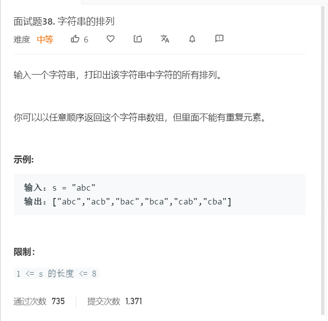

# 面试题38.字符串的排列
  

```
/**
 * @param {string} s
 * @return {string[]}
 */
var permutation = function(s) {
    let temp = [];

    let ss = s.split('').sort();

    let one = (ss,list,can) => {
        if(list.length == ss.length){
            temp.push(list.join(''));
            return;
        }

        for(let i=0;i<ss.length;i++){
            if(can.indexOf(i)<0){
                list.push(ss[i]);
                can.push(i);
                one(ss,list.slice(),can.slice());
                list.pop();
                can.pop();
                 while(ss[i] == ss[i+1]){
                    i++;
                }
            }
        }
    }

    one(ss,[],[]);

    return temp;
};
```