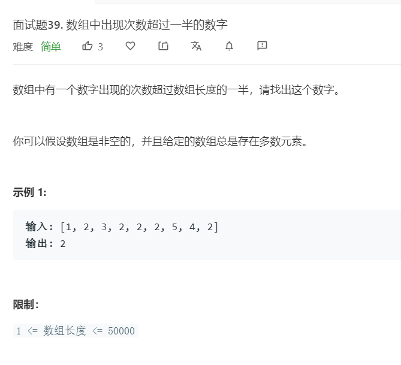

# 面试题39.数组中出现次数超过一半的数字
  

```
/**
 * @param {number[]} nums
 * @return {number}
 */
var majorityElement = function(nums) {
    nums.sort((a,b)=>a-b);

    let mid = nums.length >> 1;

    return nums[mid];
};
```