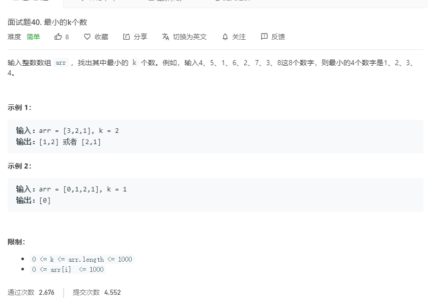

# 面试题40.最小的k个数
  

```
/**
 * @param {number[]} arr
 * @param {number} k
 * @return {number[]}
 */
var getLeastNumbers = function(arr, k) {
    arr.sort((a,b)=>a-b);
    let temp = arr.splice(0,k);
    return temp;
};
```