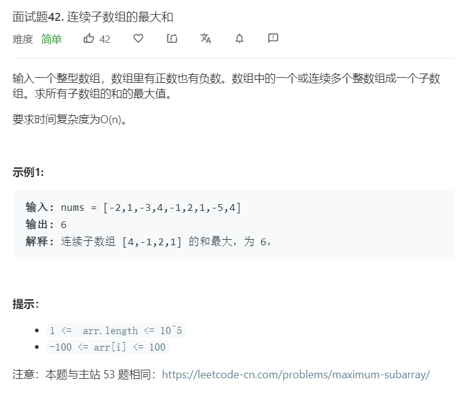

# 面试题42.连续子数组的最大和
  

```
/**
 * @param {number[]} nums
 * @return {number}
 */
var maxSubArray = function(nums) {
    let result = new Array(nums.length+1).fill(0);
    for(let i = 0;i<nums.length;i++){
        result[i+1] += Math.max(nums[i],result[i]+nums[i]);
    }

    console.log(result);
    result.shift();
    return Math.max(...result);
};
```