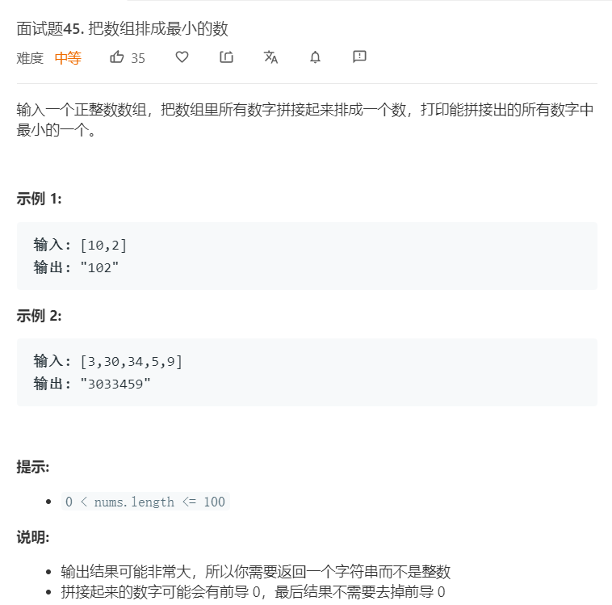

# 面试题45.把数组排成最小的数
  

- 排序判断规则： 设 numsnums 任意两数字的字符串格式 xx 和 yy ，则
    - 若拼接字符串 x + y > y + xx+y>y+x ，则 m > nm>n ；
    - 反之，若 x + y < y + xx+y<y+x ，则 n < mn<m ；

```
/**
 * @param {number[]} nums
 * @return {string}
 */
var minNumber = function(nums) {
    nums.sort((a,b)=>(+(a+''+b)) - (+(b+''+a)))

    console.log(nums);
    return nums.join('');
};
```