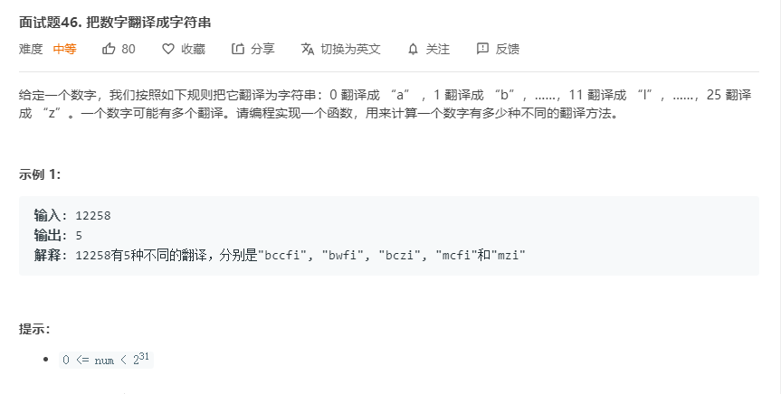
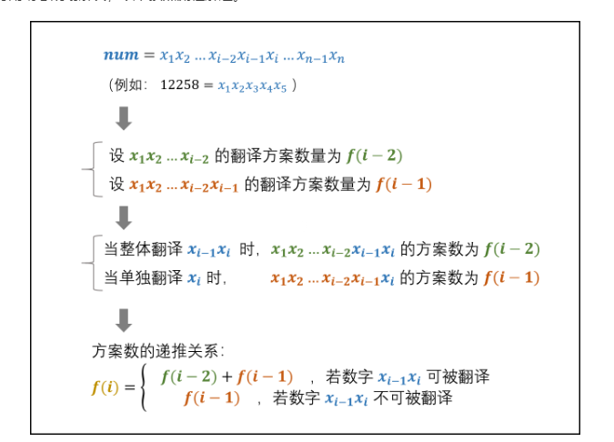
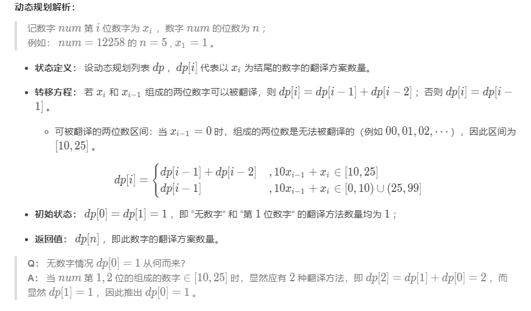

# 面试题46.把数字翻译成字符串
  

  

  

```
/**
 * @param {number} num
 * @return {number}
 */
var translateNum = function(num) {
    num = (num + '').split('');
    let len = num.length;
    let temp = new Array(len + 1).fill(1);

    for(let i=2;i< len + 1;i++) {
        let now = num.slice(i-2,i);
        if(now[0] != '0' && +(now.join('')) >= 0 && +(now.join('')) <= 25) {
            temp[i] = temp[i-1] + temp[i-2];
        }else {
            temp[i] = temp[i-1];
        }
    }

    return temp[temp.length-1];
};
```