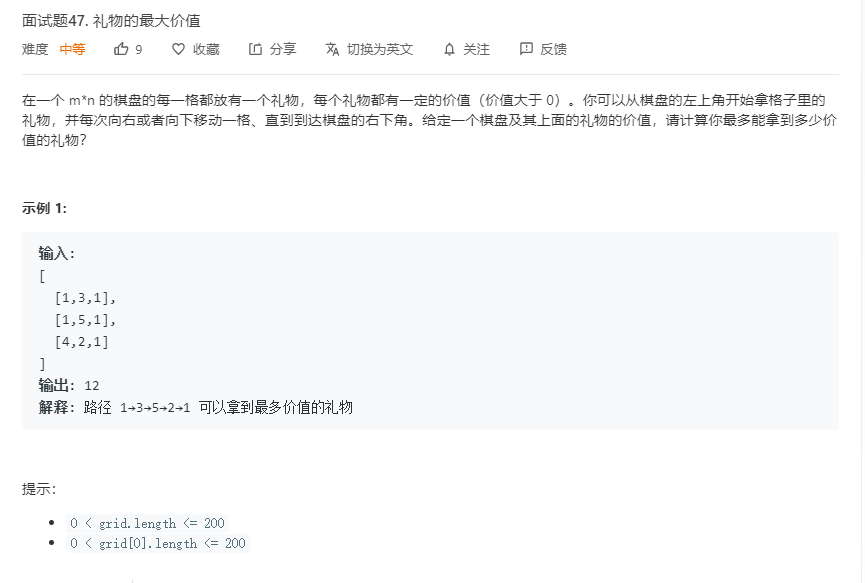
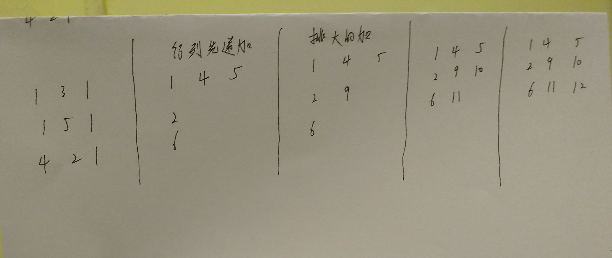

# 面试题47.礼物的最大价值
  

  

```
/**
 * @param {number[][]} grid
 * @return {number}
 */
var maxValue = function(grid) {
    let m = grid.length,n = grid[0].length;
    if(m == 0 || n == 0){
        return 0;
    }
    if(m == 1 && n == 1){
        return grid[0][0];
    }
    
    let start = new Array(m);
    for(let i=0;i<m;i++){
        start[i] = new Array(n);
    }
    start[0][0] = grid[0][0];
    //列和行先加上前一个元素
    for(let i=1;i<m;i++){
        start[i][0] = start[i-1][0] + grid[i][0]; 
    }
    for(let i=1;i<n;i++){
        start[0][i] = start[0][i-1] + grid[0][i]; 
    }

    for(let i=1;i<m;i++){
        for(let j=1;j<n;j++){
            start[i][j] = Math.max(start[i-1][j],start[i][j-1]) + grid[i][j];
        }
    }
    console.log(start);
    return start[m-1][n-1];
};
```