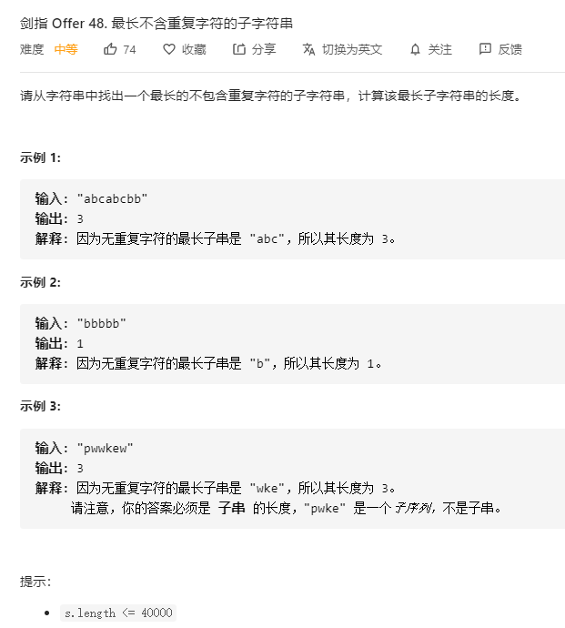

# 48最长不含重复字符的子字符串
  

```
/**
 * @param {string} s
 * @return {number}
 */
var lengthOfLongestSubstring = function(s) {
    let res = -Infinity, temp = [];

    for (let i=0;i<s.length;i++) {
        if (temp.length === 0 || temp.indexOf(s[i]) < 0) {
            temp.push(s[i]);
        } else {
            let pos = temp.indexOf(s[i]);
            temp = temp.slice(pos + 1);
            temp.push(s[i]);
        }

        res = temp.length > res ? temp.length : res;
    }

    return res === -Infinity ? 0 : res;
};
```