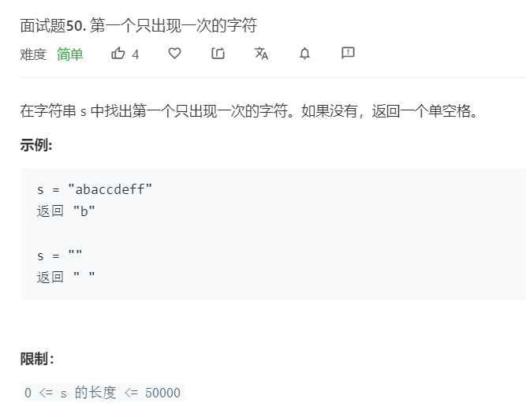

# 面试题50.第一个只出现一次的字符
  

```
/**
 * @param {string} s
 * @return {character}
 */
var firstUniqChar = function(s) {
    let temp = s.split('');
    for(let i=0;i<temp.length;i++){
        if(temp.indexOf(temp[i]) == temp.lastIndexOf(temp[i])){
            return temp[i]
        }
    }

    return ' '
};
```