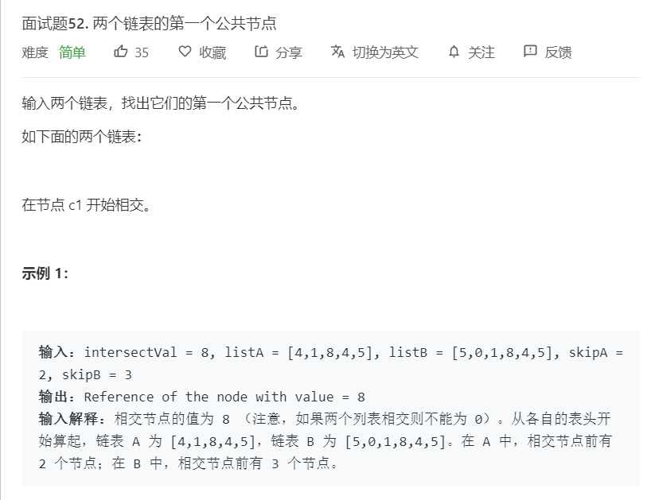
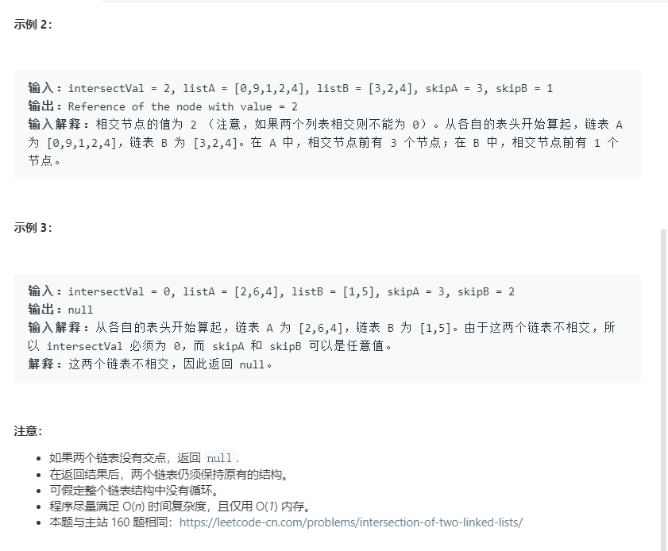

# 面试题52.两个链表的第一个公共节点
  

  

```
/**
 * Definition for singly-linked list.
 * function ListNode(val) {
 *     this.val = val;
 *     this.next = null;
 * }
 */

/**
 * @param {ListNode} headA
 * @param {ListNode} headB
 * @return {ListNode}
 */
var getIntersectionNode = function(headA, headB) {
    let one = headA, two = headB;

    while(one !== two){
        if(one !==null){
            one = one.next;
        }else{
            one = headB;
        }
         if(two !==null){
            two = two.next;
        }else{
            two = headA;
        }
    }

    return one;
};
```