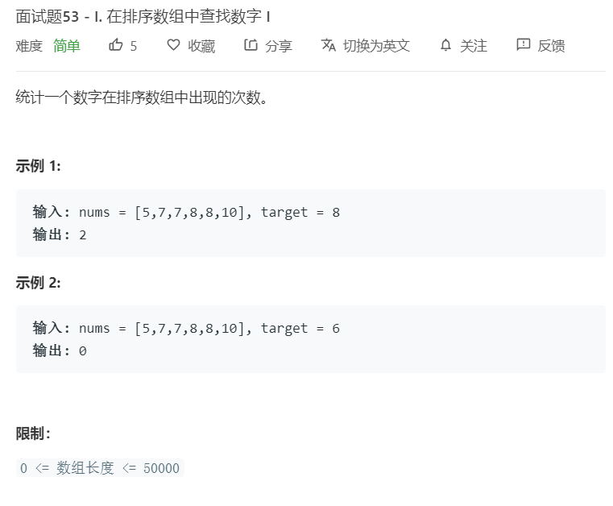

# 面试题53-1.在排序数组中查找数字I
  

```
/**
 * @param {number[]} nums
 * @param {number} target
 * @return {number}
 */
var search = function(nums, target) {
    let result = 0;
    while(nums.indexOf(target)>=0){
        result += 1;
        nums.splice(nums.indexOf(target),1);
    }
    return result;
};
```