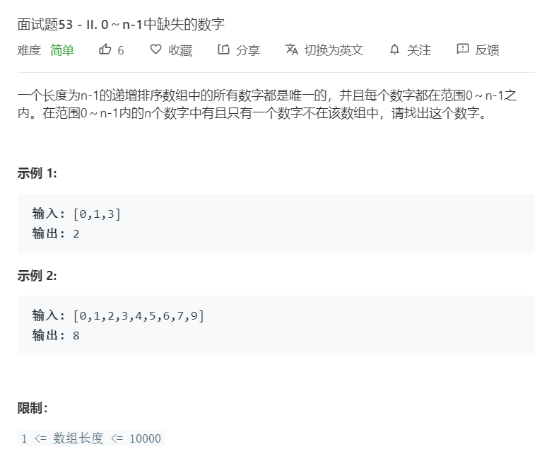

# 面试题53-2.0~n-1中缺失的数字
  

```
/**
 * @param {number[]} nums
 * @return {number}
 */
var missingNumber = function(nums) {
    let temp = [];
    for(let i=0;i<nums.length;i++){
        if(temp.length == 0){
            temp.push(nums[i]);
        }else if(nums[i] == temp[temp.length-1]+1){
            temp.push(nums[i]);
        }else{
            return temp[temp.length-1]+1;
        }
    }
    if(temp.indexOf(0)<0){
        return 0;
    }else{
        return temp[temp.length-1]+1;
    }
};
```