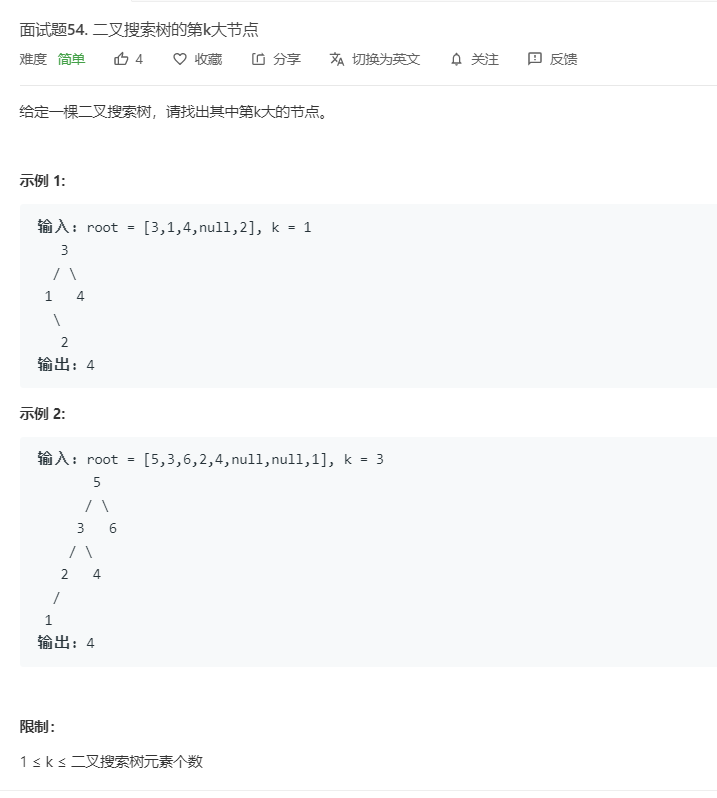

# 面试题54.二叉搜索树的第k大节点
  

```
/**
 * Definition for a binary tree node.
 * function TreeNode(val) {
 *     this.val = val;
 *     this.left = this.right = null;
 * }
 */
/**
 * @param {TreeNode} root
 * @param {number} k
 * @return {number}
 */
var kthLargest = function(root, k) {
    let result = [];

    let one = (root) => {
        if(root){
            one(root.left);
            result.push(root.val);
            one(root.right);
        }
    }

    one(root);
    console.log(result)
    return result[result.length-k];
};
```