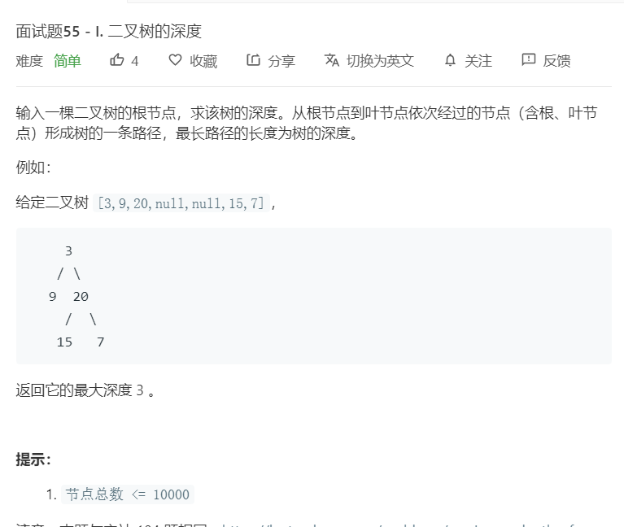

# 面试题55-I.二叉树的深度
  

```
/**
 * Definition for a binary tree node.
 * function TreeNode(val) {
 *     this.val = val;
 *     this.left = this.right = null;
 * }
 */
/**
 * @param {TreeNode} root
 * @return {number}
 */
var maxDepth = function(root) {
    if(!root){
        return 0;
    }
    let temp = [root],result = [];
    while(temp.length){
        let one = [],two = [];
        while(temp.length){
            let now = temp.shift();
            one.push(now.val);
            if(now.left){
                two.push(now.left);
            }
            if(now.right){
                two.push(now.right);
            }
        }
        temp = two;
        result.push(one);
    }
    return result.length;
};
```