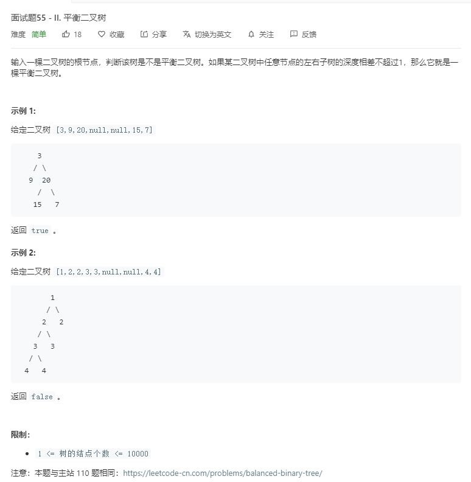

# 面试题55-II.平衡二叉树
  

```
/**
 * Definition for a binary tree node.
 * function TreeNode(val) {
 *     this.val = val;
 *     this.left = this.right = null;
 * }
 */
/**
 * @param {TreeNode} root
 * @return {boolean}
 */
var isBalanced = function(root) {
    if(!root){
        return true;
    }

    if(Math.abs(one(root.left) - one(root.right)) > 1){
        return false;
    }

    return isBalanced(root.left) && isBalanced(root.right);
};

const one = (r) => {
        if(!r){
            return 0;
        }

        return Math.max(one(r.left),one(r.right)) + 1;
    }
```