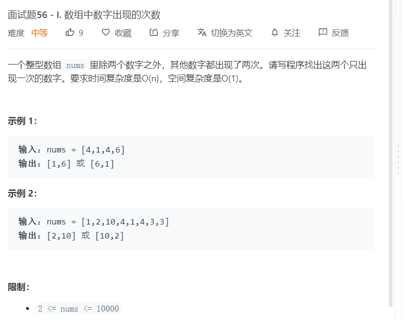

# 面试题56-I.数组中数字出现的次数
  

```
/**
 * @param {number[]} nums
 * @return {number[]}
 */
var singleNumbers = function(nums) {
    let temp = [];
    for(let i=0;i<nums.length;i++){
        if(temp.indexOf(nums[i])>=0){
            temp.splice(temp.indexOf(nums[i]),1);
        }else{
            temp.push(nums[i]);
        }
    }

    return temp;
};
```