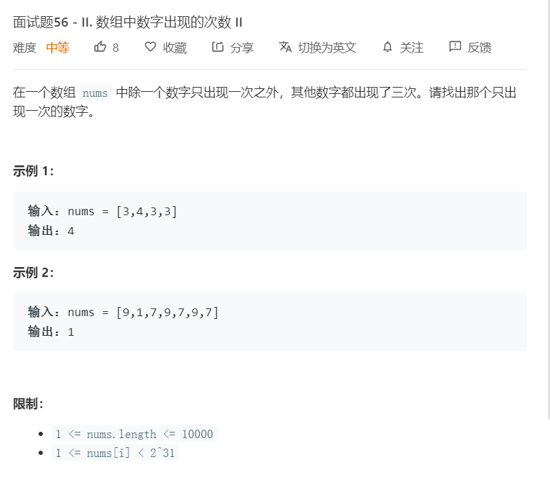

# 面试题56-II.数组中数字出现的次数II
  

```
/**
 * @param {number[]} nums
 * @return {number}
 */
var singleNumber = function(nums) {
    nums.sort((a,b)=>a-b);
    for(let i=0;i<nums.length;i++){
        if(nums[i+1]!=nums[i]){
            return nums[i];
        }else{
            i += 2;
        }
    }
};
```