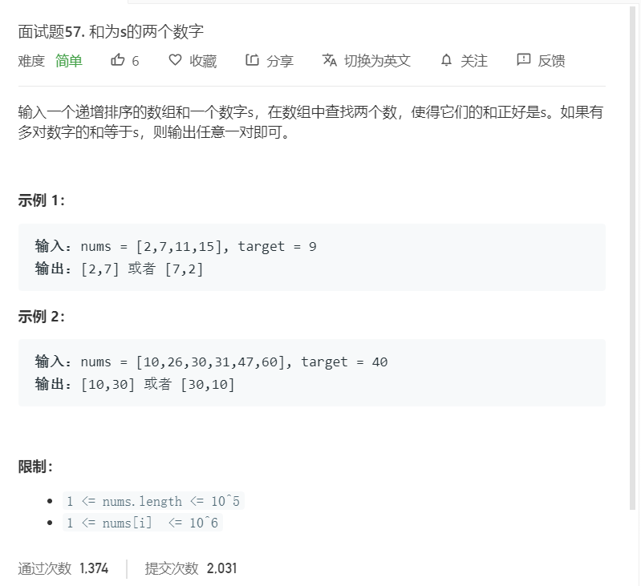

# 面试题57.和为s的两个数字
  

```
/**
 * @param {number[]} nums
 * @param {number} target
 * @return {number[]}
 */
var twoSum = function(nums, target) {
    let result = [];
    let left = 0,right = nums.length-1;
    while(nums[left] + nums[right] != target){
        if(nums[left] + nums[right] < target){
            left++;
        }
        if(nums[left] + nums[right] > target){
            right--;
        }
    }

    return [nums[left],nums[right]]
};
```