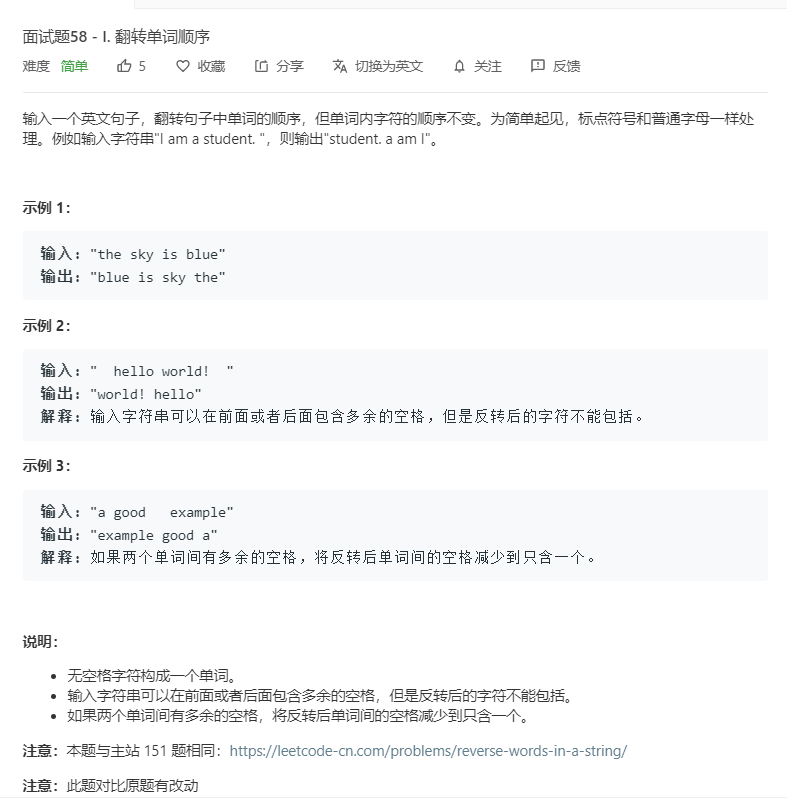

# 面试题58-I.翻转单词顺序
  

```
/**
 * @param {string} s
 * @return {string}
 */
var reverseWords = function(s) {
    s = s.trim();
    let temp = s.split(' ');
    temp.reverse();
    for(let i=0;i<temp.length;i++){
        if(temp[i].length == 0){
            temp.splice(i,1);
            i--;
        }
    }
    console.log(temp)
    return temp.join(' ');
};
```