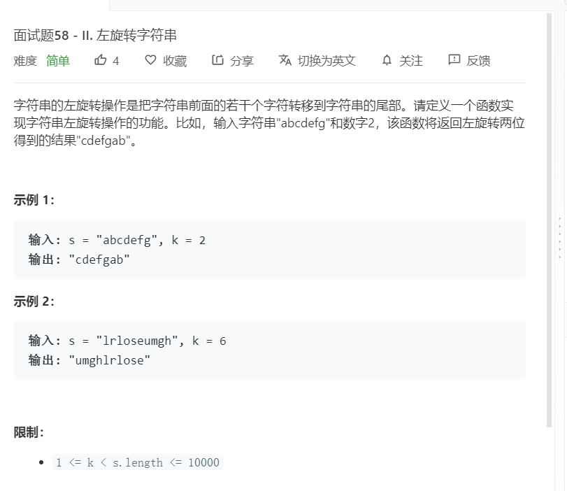

# 面试题58-II.左旋转字符串
  

```
/**
 * @param {string} s
 * @param {number} n
 * @return {string}
 */
var reverseLeftWords = function(s, n) {
    let temp = s.split('');
    let now = [];
    for(let i=0;i<n;i++){
        now.push(temp.shift());
    }

    let result = temp.concat(now);
    return result.join('');
};
```