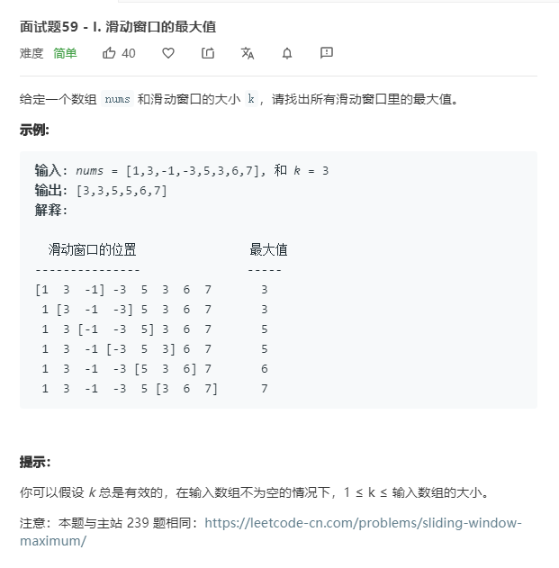

# 面试题59-I.滑动窗口的最大值

```
/**
 * @param {number[]} nums
 * @param {number} k
 * @return {number[]}
 */
var maxSlidingWindow = function(nums, k) {
    if(nums.length == 0 || k == 0){
        return [];
    }

    let temp = nums.slice(0,k);
    let result = [Math.max(...temp)];
    for(let i = k;i<nums.length;i++){
        temp.shift();
        temp.push(nums[i]);
        result.push(Math.max(...temp));
    }

    console.log(result)

    return result
};
```