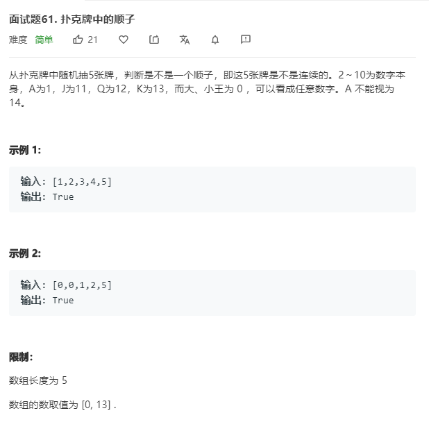

# 面试题61.扑克牌中的顺子
  

```
/**
 * @param {number[]} nums
 * @return {boolean}
 */
var isStraight = function(nums) {
    let result = [];

    nums.sort((a,b)=>a-b);

    let change = [];
   while(nums[0] == 0){
       change.push(0);
       nums.shift();
   }

   result.push(nums.shift());

   console.log(change,result,nums);

   let len = nums.length + change.length;
    for(let i=0;i<len;i++){
        if(nums[i] == result[result.length - 1] + 1){
            result.push(nums[i]);
        }else if(change.length != 0){
            result.push(result[result.length - 1] + 1);
            change.shift();
            i--;
        }
    }

    console.log(result);
    return result.length === 5;
};
```