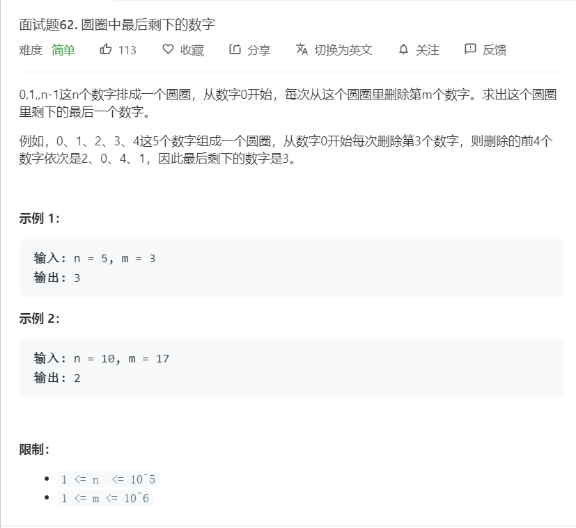

# 面试题62.圆圈中最后剩下的数字
  

```
/**
 * @param {number} n
 * @param {number} m
 * @return {number}
 */
var lastRemaining = function(n, m) {
    let temp = new Array(n);
    for(let i=0;i<n;i++){
        temp[i] = i;
    }

    let start = 0;
    while(temp.length > 1){
        start = (start + m - 1) % temp.length;
        temp.splice(start,1);
    }

    

    return temp[0];
};
```