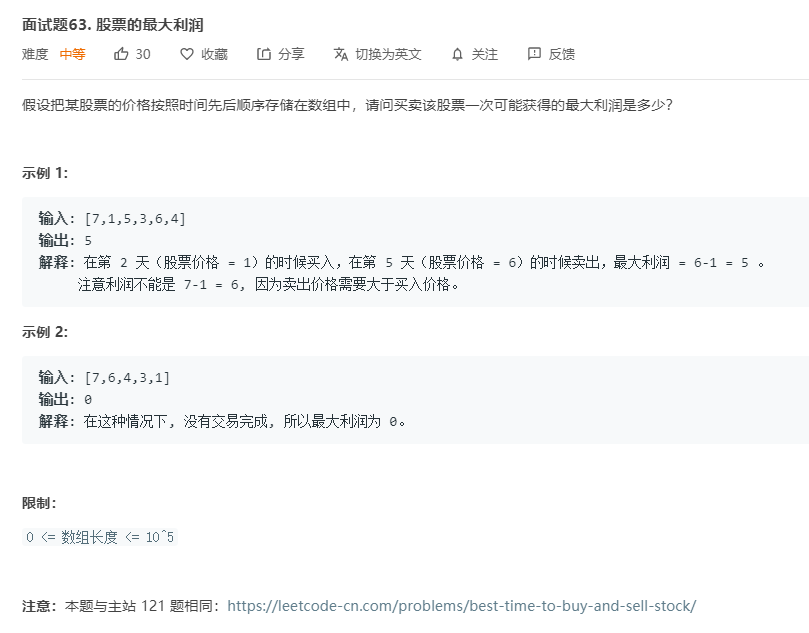

# 面试题63.股票的最大利润
  

```
/**
 * @param {number[]} prices
 * @return {number}
 */
var maxProfit = function(prices) {
    let min = Infinity, max = 0;

    prices.map((el) => {
        min = Math.min(el,min);
        max = Math.max(max, el-min);
    })

    return max;
};
```