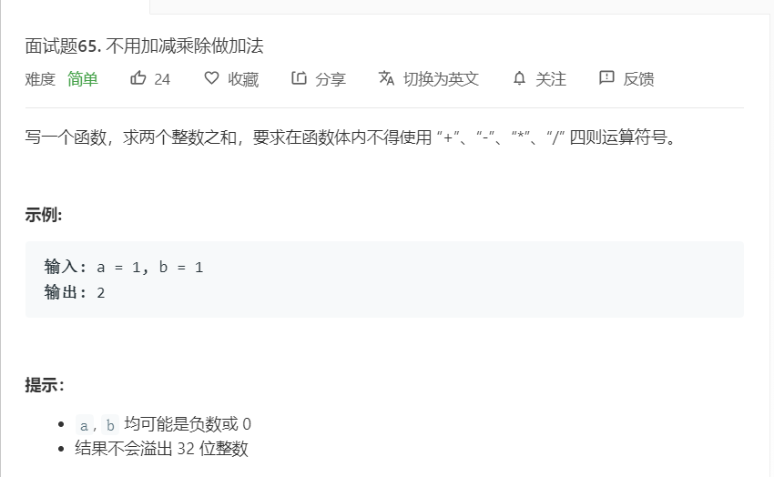

# 面试题65.不用加减乘除做加法
  

```
/**
 * @param {number} a
 * @param {number} b
 * @return {number}
 */
var add = function(a, b) {
    while(b != 0){
        let temp = a ^ b;
        b = (a & b) << 1;
        a = temp;
    }
    return a;
};
```