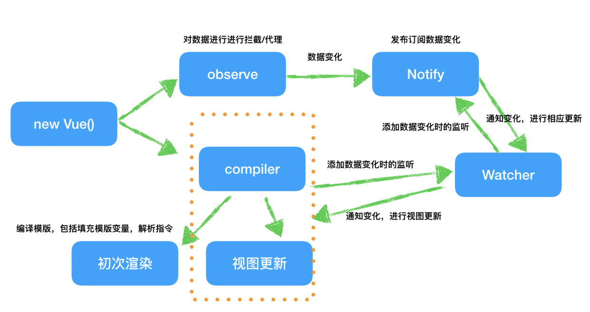

### 1.路由组件怎么缓存

> 使用\<keep-alive>\</keep-alive>包裹该组件.  
> 退出时触发 deactivated 当再次进入（前进或者后退）时，只触发 activated

```
<keep-alive>
    <router-view></router-view>
</keep-alive>
```

### 2.cookie和session的区别

> 1. cookie数据存放在客户端的浏览器上，session存在在服务器上
> 2. cookie不安全，容易被人获取
> 3. session会在一定时间内保存在服务器上。当访问增多时，会比较占用你服务器的性能考虑到减轻服务器性能方面，应当使用cookie
> 4. 单个cookie保存的数据不能超过4K,很多浏览器都限制一个站点最多保存20个cookie  

> 存储在cookie中的数据，每次都会被浏览器自动放在http请求中  

```
document.cookie

//设置cookie属性
"key=name; expires=Thu, 25 Feb 2016 04:18:00 GMT; domain=ppsc.sankuai.com; path=/; secure; HttpOnly"
```
- expires:过期时间(http/1.1中换成max-age)
- domian(域名)、path(路径)：决定cookie何时被浏览器添加到请求头部中(跨域问题)
- secure:设置cookie只有在确保安全的请求中才会发送
- httpOnly:设置cookie是否能通过js去访问(XSS攻击)

### 3.有几种跨域的方式，分别

> 1. jsonp:利用\<script>标签没有跨域限制的漏洞，网页可以得到从其他来源动态产生JSON数据。JSONP请求一定需要对方的服务器做支持才可以。(仅支持get方法，会遭受XSS攻击)
> 2. cors:需要浏览器和后端同时支持，服务端设置**Access-Control-Allow-Origin**就可以开启CORS
> 3. nginx反向代理：通过nginx配置一个代理服务器(域名与domain1相同，端口不同)做跳板机，反向代理访问domain2接口，并且可以顺便修改cookie中domain信息，方便当前域cookie写入，实现跨域登录。
> 4. websocket:双向通信协议，在建立连接后，server与client都能主动向对方发送或接受数据。

### 4.实时刷新列表
> 1. 长轮询:客户端发起连接后，如果没消息，就一直不返回Response给客户端。直到有消息才返回，返回完之后，客户端再次建立连接，周而复始。
> 2. ajax轮询:让浏览器隔个几秒就发送一次请求，询问服务器是否有新信息。
> 3. 使用websocket：服务端就可以主动推送信息给客户端(只需要经过一次HTTP请求，就可以做到源源不断的信息传送了)  

**websocket: 通过单个tcp套接字在客户端和服务端间提供持续的实时通信**


### 5.事件绑定，考虑到性能页面优化的情况下，怎么绑定比较好

> 页面元素尽量使用事件代理，避免直接事件绑定。  
> 使用事件代理可以避免对每个元素都进行绑定，并且可以避免出现内存泄漏及需要动态添加元素的事件绑定问题，所以尽量不要直接使用事件绑定。

```
//html
<table>
  <tr>
    <th colspan="3"><em>Bagua</em> Chart: Direction, Element, Color, Meaning</th>
  </tr>
  <tr>
    <td>...<strong>Northwest</strong>...</td>
    <td>...</td>
    <td>...</td>
  </tr>
  <tr>...2 more lines of this kind...</tr>
  <tr>...2 more lines of this kind...</tr>
</table>

//js
let selectedTd;

table.onclick = function(event) {
  let target = event.target; // 在哪里单击的？

  if (target.tagName != 'TD') return; // 不在 TD 上？那么我们就不会在意

  highlight(target); // 高亮显示
};

function highlight(td) {
  if (selectedTd) { // 移除任何已存在的高亮显示内容
    selectedTd.classList.remove('highlight');
  }
  selectedTd = td;
  selectedTd.classList.add('highlight'); // 高亮新的 td
}
```
算法：
1. 在容器上设置一个处理器。
2. 在处理器中 —— 检查源元素的 event.target。
3. 如果事件发生在我们感兴趣的元素中，那么处理该事件。  

好处：  
1. 简化初始化并节省内存：不需要添加许多处理器。
2. 更少的代码：添加或移除元素时，不需要添加/移除处理器。
3. DOM 修改 ：我们可以使用 innerHTML 等来大量添加/移除元素。  

局限性：  
1. 事件必须冒泡。而有些事件不会冒泡。
2. 委托会增加 CPU 负载，因为容器等级的处理器对容器中任何位置的事件做出反应，不管它们是否会引起我们的兴趣。但是通常负载是可以忽略不计的，所以我们不考虑它。

### 6.csrf攻击原理及怎么防范

> CSRF(Cross-site request forgery),"跨站请求伪造"，是指黑客引诱用户打开黑客的网站，在黑客的网站中，利用用户的登录状态发起的跨站请求。   
 
> CSRF攻击的三个必要条件
> 1. 目标站点一定要有CSRF漏洞
> 2. 用户要登录过目标站点，并且在浏览器上保持有该站点的登录状态
> 3. 需要用户打开一个第三方站点，可以是黑客的站点，也可以是一些论坛  

> 防止攻击：  
> 1. 通常CSRF攻击都是从第三方站点发起的，要防止CSRF攻击，最好实现从第三方站点发送请求时禁止Cookie的发送。  
> Cookie的**SameSite**属性会决定是否发送cookie  
> 2. 在服务器端验证请求来源的站点
> 3. 在浏览器向服务器发起请求时，服务器生成一个CSRF Token。CSRF Token其实就是服务器生成的字符串，然后将该字符串植入到返回的页面中。在浏览器端如果要发起转账的请求，那么需要带上页面中的CSRF Token，然后服务器会验证该Token是否合法。如果是从第三方站点发起请求，那么将无法获取到CSRF Token的值，所以即使发起了请求，服务器也会因为CSRF Token不正确而拒绝请求。

token存放在session中

### 7.跨站脚本攻击(XSS)
> XSS(Cross Site Scripting)攻击是指黑客往HTML文件中或者DOM中注入恶意脚本，从而在用户浏览页面时利用注入的恶意脚本对用户实施攻击的一种手段  
> 防范：服务器可以将某些Cookie设置为HttpOnly标志。由于JS无法读取设置了HttpOnly的Cookie数据，所以即使页面被注入了恶意Js脚本，也是无法获取到设置了HttpOnly的数据。

### 8.webpack怎么把css文件单独分离出来

> 在module中设置转换规则，test中设置匹配的路径正则表达式，include中设置文件路径，use中导入需要用到的loader

### 9.webpack的热更新怎么实现的

  

> 1. Webpack-dev-middleware调用webpack的API来监视文件系统。当文件更改时，webpack会重新编译和打包文件并将其保存到内存中。
> 2. devServer通知浏览器端文件更改。  
> 当启动devServer时，sockjs在服务器和浏览器之间建立长连接，以通知浏览器Webpack编译和打包各个阶段的状态。 最关键的一步是webpack-dev-server调用webpack API来侦听编译完成的事件。 编译完成后，webp Ack-dev-server通过_sendStatus方法将已编译并打包的新模块的哈希值发送到浏览器。
> 3. webpack-dev-server / client接收服务端消息并响应   
> Webpack-dev-server通过添加webpack-dev-client代码来修改webpack配置中的entry属性，以便将websocket消息的代码接收到最终的bundle.js文件中。  
> Webpack-dev-server / client收到类型为hash的消息时会临时保存哈希值，并在收到类型为ok的消息时重新加载应用程序。  
> 在重新加载操作中，webpack-dev-server / client会根据热配置决定是刷新浏览器还是热更新代码（HMR）。
> 4. webpack接收最新的散列值，验证并请求模块代码
> 5. 运行时热更新模块

### 10.tree shaking(摇树优化)

> tree shaking就是把模块中用到的方法打入bundle中，没用到的则在uglify阶段被擦除掉。

### 11.webpack第三方库

> 引入webpack,在plugins在引入webpack.ProvidePlugin插件，然后在其中设置第三方库，这样就会按需加载  

> 提取第三方库：把入口文件和第三方库分开，然后在optimization中设置缓存组和提取条件。

### 12.http与https

> https有加密，具有多路复用，可以减少队头阻塞，提高传输速度。

### 13.深拷贝

> 1. JSON对象的parse和stringify
> 2. 利用递归遍历，判断如果是引用类型则创建一个新对象，遍历后添加到这个上面

### 14.浅拷贝

> 1. Object.assign
> 2. 运算符...

### 15.Vue 和 React 之间的区别

> 1. 模板 vs JSX
> 2. 数据绑定：  
- Vue采用双向绑定策略，依靠Object.defineProperty(Vue3.0使用Proxy)以及监听DOM事件实现。  

> 双向绑定和单向数据流并没有直接关联，双向绑定是指数据和视图之间的绑定关系，而单向数据流是指组件之间数据的传递。  

- React采用**局部刷新**，当数据发生变化时，直接重新渲染组件，以得到最新的视图。

3. 组件化和数据流

### 16.强制缓存与协商缓存的区别

> 1. 强缓存：浏览器再次加载资源时，如果在过期时间内，则命中强缓存。(浏览器直接从本地缓存中获取数据，不与服务器进行交互。)  
> state code为200.使用两种HTTP Header实现：Expires(未来的时间戳)和Cache-Control(过期时间)
> 2. 协商缓存：如果缓存过期了，就需要发起请求验证资源是否有更新。(浏览器发送请求到服务器，服务器判断是否可使用本地缓存)通过设置两种HTTP Header:Last-Modified(资源的最后修改时间)和ETag(资源在服务器的唯一标识).  
> 当浏览器发起请求验证资源时，如果资源没有做改变，那么服务端就会返回304状态码，并且更新浏览器缓存有效期。

### 17.节流
> 隔一段时间发起一次请求

```
function throttle(fn,delay){
  //记录上一次函数触发的时间
  var lastime = 0;
  return function(){
    //记录当前函数触发的时间
    var nowTime = Date.now();
    if(nowTime - lastTime > delay){
      //修正this指向问题
      fn.call(this);
      //同步时间
      lastTime = nowTime;
    }
  }
}
```

### 18.防抖

> 当用户点击按钮一段时间后没有再次点击的情况才去发起网络请求

```
function debounce(fn,delay){
  //记录上一次的延时器
  var timer = null;
  return function(){
    clearTimeout(timer);
    timer = setTimeout(function(){
      fn.apply(this);
    },delay);
  }
}
```

### 19.哪些方式可以减少webpack的打包时间

> 1. 优化Loader,优化文件搜索范围
> 2. 代码压缩

### 20.减少Webpack打包后的文件体积

> 1. 按需加载：将每个路由页面单独打包为一个文件
> 2. Scope Hoisting:会分析出模块间的依赖关系，尽可能的把打包出来的模块合并到一个函数中。
> 3. Tree Shaking:删除项目中未被引用的代码。

### 21.进程和线程的区别

> 进程是具有一定独立功能的程序，是系统进行资源分配调度的一个独立单位  
> 线程是进程的一个实体，是cpu调度分派的基本单位，线程之间基本上不拥有系统资源  
> 一个程序至少有一个进程，一个进程至少有一个线程，资源分配给进程，同一个进程下所有线程共享该进程的资源。

### 22.computed和watch的区别

> computed:计算属性(不存在data中)。由data中的已知值，得到一个新值。这个新值会根据已知值的变化而变化，其他不相关的变化不会影响该值。  
> 计算属性是定义变量的get和set,对于复杂数据类型，引用地址不变，则不会触发set,get会缓存，不会重复计算。    

> watch:监听数据的变化。数据在data中。  
  
> watch：一个数据影响多个数据  
> computed:一个数据受多个数据影响

### 23.闭包的使用场景

> 函数嵌套函数时，内层函数引用了外层函数作用域下的变量，并且内层函数在全局环境下可访问，就形成了闭包。  

> 函数保存其外部的变量并且能够访问他们称之为闭包。在JS中函数都是天生的闭包。他们会通过隐藏的[[Environment]]属性记住创建他们的位置，所以他们都可以访问外部变量。

> 1.函数防抖  

```
window.onresize = debounce(fn,500)

function debounce(fn){
        var timer = null
        return function(){
          if(timer){     //timer第一次执行后会保存在内存里 永远都是执行器 直到最后被触发
            clearTimeout(timer)
              timer = null
          }
          timer = setTimeout(function(){
              fn()
          },1000)
        }
    
}
var fn = function(){
    console.log('fn')
}

```

> 2.for循环中的使用

### 24.如果不能使用bind/call/apply,有什么办法对this进行干预

```
const o1 = {
    text: 'o1',
    fn: function() {
        return this.text
    }
}
const o2 = {
    text: 'o2',
    fn: function() {
        return o1.fn()
    }
}

//输出 o2,该怎么做？
console.log(o2.fn())
```

**this指向最后调用它的对象**，在 fn 执行时，挂到 o2 对象上即可，我们提前进行了赋值操作。
```
const o1 = {
    text: 'o1',
    fn: function() {
        return this.text
    }
}
const o2 = {
    text: 'o2',
    fn: o1.fn
}

console.log(o2.fn())
```

### 25.bind的实现

> 利用Array.prototype.slice.call获取参数对象，用apply来改变this的指向  

```
//formerArgs为传递给bind函数的第二个到之后的参数
Function.prototype.bind = function (ctx,...formerArgs){
    let _this = this;

    //laterArgs为传递给原函数的参数
    return (...laterArgs) => {
        // bind 函数的不定参数在原函数参数之前，formerArgs 本身就是数组，可以直接调用数组的 concat 方法，无需借助 call 或 apply
        return _this.apply(ctx,formerArgs.concat(laterArgs));
    }
}
```

### 26.call的实现

```
Function.prototype.mycall = function (context) {
  context.fn = this
  context.fn()
  delete context.fn
}
```
**this指向最后调用它的对象**  

> mycall接收一个参数，即一个对象，最终的this指向这个对象。函数内部实现在这个传入的对象中绑定上我们需要执行的这个函数，即context.fn = this一行。最后调用context.fn()。因为我们这样操作修改了传入对象的属性（添加了一个fn属性），所以最后需要删除这个fn属性。

### 27.如何实现数据双向绑定的

Vue数据双向绑定主要指：**数据变化更新视图，视图变化更新数据**  

1. 实现一个监听器Observer:对数据对象进行遍历，包括子属性对象的属性，利用 Object.defineProperty() 对属性都加上 setter 和 getter。
2. 实现一个解析器Compile:解析 Vue 模板指令，将模板中的变量都替换成数据，然后初始化渲染页面视图，并将每个指令对应的节点绑定更新函数，添加监听数据的订阅者，一旦数据有变动，收到通知，调用更新函数进行数据更新。
3. 实现一个订阅者Watcher:主要的任务是订阅 Observer 中的属性值变化的消息，当收到属性值变化的消息时，触发解析器 Compile 中对应的更新函数。
4. 实现一个订阅器Dep:订阅器采用 发布-订阅 设计模式，用来收集订阅者 Watcher，对监听器 Observer 和 订阅者 Watcher 进行统一管理



1. Object.defineProperty 不能监听数组的变化，需要进行数组方法的重写
2. Object.defineProperty 必须遍历对象的每个属性，且对于嵌套结构需要深层遍历
3. Proxy 的代理是针对整个对象的，而不是对象的某个属性，因此不同于 Object.defineProperty 的必须遍历对象每个属性，Proxy 只需要做一层代理就可以监听同级结构下的所有属性变化，当然对于深层结构，递归还是需要进行的
Proxy 支持代理数组的变化
4. Proxy 的第二个参数除了 set 和 get 以外，可以有 13 种拦截方法，比起 Object.defineProperty() 更加强大，这里不再一一列举

### 28.虚拟DOM

> 因为虚拟 DOM 是个树形结构，所以我们需要对两份虚拟 DOM 进行递归比较，将变化存储在一个变量中

```
const diff = (oldVirtualDom, newVirtualDom) => {
    let patches = {}

    // 递归树，比较后的结果放到 patches
    walkToDiff(oldVirtualDom, newVirtualDom, 0, patches)

     // 返回 diff 结果 
    return patches
}
```

1. 如果 newVirtualDom 不存在，说明该节点被移除，我们将 type 为 REMOVE 的对象推进 diffResult 变量，并记录 index
2. 如果新旧节点都是文本节点，是字符串.比较文本是否相同，如果不同则记录新的结果
3. 如果新旧节点类型相同,比较属性是否相同,如果有子节点，遍历子节点

> 开发者给每一个 element 通过提供 **key** ，这样 react 可以准确地发现新旧集合中的节点中相同节点，对于相同节点无需进行节点删除和创建，只需要将旧集合中节点的位置进行移动，更新为新集合中节点的位置。

### 29.数据类型

1. 快速变更型：可能随着用户输入在短时间内持续发生变化---放于React组件中
2. 中等持续型数据：在用户浏览或使用应用时，这类数据往往会在页面刷新前保持稳定。(Ajax、个人中心页)-----Redux的store中
3. 长久稳定型数据： 指在页面多次刷新或者多次访问期间都保持不变的数据。------服务端数据库或localStorage  

> 广义上，越多组件需要消费同一种数据，那么这种数据维护在 Redux store 当中就越合理；反之，如果某种数据隔离于其他数据，只服务于应用中某单一部分，那么由 React 维护更加合理。

### 30.模块化

1. CommonJS---Nodejs(module.exports 和 require 方法)

- 文件即模块，文件内所有代码都运行在独立的作用域，因此不会污染全局空间。
- 模块可以被多次引用、加载。在第一次被加载时，会被缓存，之后都从缓存中直接读取结果。
- 加载某个模块，就是引入该模块的 module.exports 属性。
- module.exports 属性输出的是值的拷贝，一旦这个值被输出，模块内再发生变化不会影响到输出的值。
- 模块加载顺序按照代码引入的顺序。
- 注意 module.exports 和 exports 的区别

2. ES6

> ES 模块的设计思想是尽量静态化，这样能保证在编译时就确定模块之间的依赖关系，每个模块的输入和输出变量也都是确定的。CommonJS 和 AMD 模块，无法保证前置即确定这些内容，只能在运行时确定。这是 ES 模块化和其他规范的显著不同。第二个差别在于，**CommonJS 模块输出的是一个值的拷贝，ES 模块输出的是值的引用**。    

> 通过静态分析，我们能够分析出导入的依赖。如果导入的模块没有被使用，我们便可以通过 tree shaking 等手段减少代码体积，进而提升运行性能。这就是基于 ESM 实现 tree shaking 的基础

ES6

```
// data.js
export let data = 'data'
export function modifyData() {
    data = 'modified data'
}

// index.js
import { data, modifyData } from './lib'
console.log(data) // data
modifyData()
console.log(data) // modified data
```

CommonJS规范  

```
// data.js
var data = 'data'
function modifyData() {
    data = 'modified data'
}

module.exports = {
    data: data,
    modifyData: modifyData
}

// index.js
var data = require('./data').data
var modifyData = require('./data').modifyData
console.log(data) // data
modifyData()
console.log(data) // data
```

### 31.Vue组件间通信的方式

1. props/$emit:父子组件间通信
2. ref与\$parent/$children：父子组件通信
3. EventBus(\$emit/$on):父子、隔代、兄弟组件
4. provide/inject:隔代组件通信
5. Vuex

- EventBus事件总线

1. 新建一个.js文件,或者直接在main.js中初始化

```
//event-bus.js
import Vue from 'vue';
export const EventBus = new Vue();
```

```
//main.js
Vue.prototype.$EventBus = new Vue();
```

2. 发送事件

```
<!-- A.vue -->
<template>
    <button @click="sendMsg()">-</button>
</template>

<script> 
import { EventBus } from "../event-bus.js";
export default {
  methods: {
    sendMsg() {
      EventBus.$emit("aMsg", '来自A页面的消息');
    }
  }
}; 
</script>
```

3. 接收事件

```
<!-- IncrementCount.vue -->
<template>
  <p>{{msg}}</p>
</template>

<script> 
import { 
  EventBus 
} from "../event-bus.js";
export default {
  data(){
    return {
      msg: ''
    }
  },
  mounted() {
    EventBus.$on("aMsg", (msg) => {
      // A发送来的消息
      this.msg = msg;
    });
  }
};
</script>
```

### 32.单页面应用路由实现原理

> **Hash路由的使用**,因为hash值的改变不会引起页面的刷新，并且当url的hash发生变化的时候，可以触发相应的hashchange回调函数。

### 33.请你描述一下 cookies，sessionStorage 和 localStorage 的区别?

> **相同点：**  
> 都存储在客户端  

> **不同点：**  
> 1. 存储大小  
> - cookie数据大小不能超过4K
> - sessionStorage和localStorage可以达到5M或更大  
> 2. 有效时间  
> - localStorage存储持久数据，浏览器关闭后数据不丢失除非主动删除数据
> - sessionStorage数据在当前浏览器窗口关闭后主动删除
> cookie设置的cookie过期时间之前一直有效，即使窗口或浏览器关闭  
> 3. 数据与服务器之间的交互方式   
> - cookie的数据会自动传递到服务器，服务器端也可以写cookie到客户端
> - sessionStorage和localStorage不会自动把数据发给服务器，仅在本地保存  

### 34.如果已经有三个promise，A、B和C，想串行执行，该怎么写？

```
//promise
A.then(B).then(C).catch();

//async/await
(async ()=>{
    await a();
    await b();
    await c();
})()
```

### 35.NodeJs事件循环
1. Node.js服务器端启动并初始化一个事件队列，然后创建一个事件循环，它是无限循环的单线程
2. 客户端发送请求
3. 服务器端接收到请求并放入事件队列
4. 时间循环检查事件队列，采取先进先出的策略从事件队列中取出请求，判断请求是否会阻塞I/O,如果会阻塞I/O，那么会从底层的线程池中取出线程用来处理请求，事件循环线程继续执行；如果不会阻塞I/O，那么事件循环线程处理请求
5. 线程处理完请求并返回结果给客户端

### 36.浏览器输入URL
> 浏览器判断是不是ip地址，不是就进行域名解析，依次通过浏览器缓存，系统缓存，host文件，还是没找到的请求DNS服务器获取IP解析(解析失败的浏览器尝试换别的DNS服务器，最终失败的进入错误页面)，有可能获取到CDN服务器IP地址，访问CDN时先看是否缓存了，缓存了响应用户，无法缓存，缓存失效或者无缓存，回源到服务器。经过防火墙外网网管路由到nginx接入层。ng缓存中存在的直接放回，不存在的负载到web服务器。web服务器接受到请后处理，路径不存在404。存在的返回结果(服务器中也会有redis,ehcache(堆内外缓存)，disk等缓存策略)。原路返回，CDN加入缓存响应用户。


